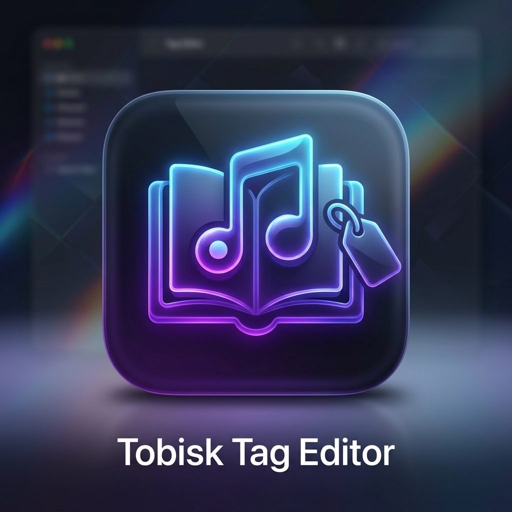
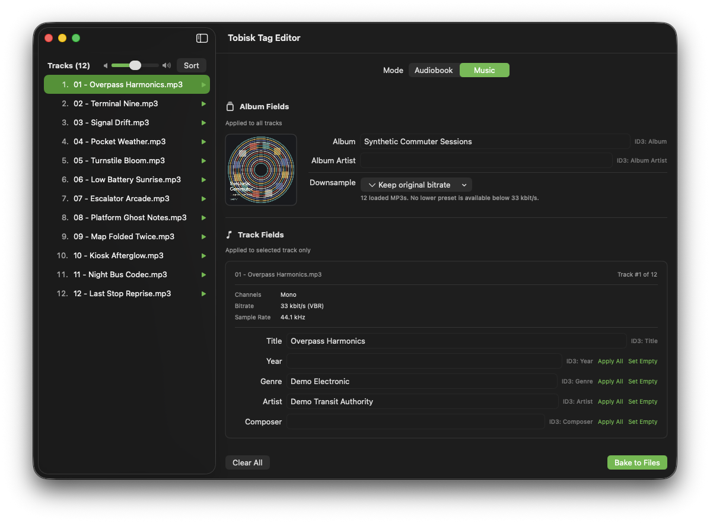

# Tosk Tag



A native macOS SwiftUI app for bulk-editing MP3 metadata.

Tosk Tag is designed for organizing audiobook chapters and music albums. Drop files or folders into the app, arrange tracks, preview audio, set global metadata, and bake ID3 tags directly into the MP3 files.

## Features

- Native SwiftUI macOS interface.
- Drag-and-drop loading for MP3 files and folders.
- Natural filename sorting and existing-track-number sorting.
- Audiobook and music tagging modes.
- Bulk fields for album, album artist, cover art, and other repeated values.
- Apply-all and set-empty helpers for per-track fields.
- Integrated audio preview.
- Direct ID3v2.3 writing through `ID3TagEditor`.

## Screenshots



## Install with Homebrew

The bootstrap installer needs only macOS and an internet connection. It installs Homebrew when needed, lets Homebrew provision Apple's Swift build tools and the `lame` MP3 encoder, builds Tosk Tag from the latest source, and installs the app in `/Applications`:

```sh
/bin/bash -c "$(curl -fsSL https://raw.githubusercontent.com/kellertobias/tosk-tag/main/install-homebrew.sh)"
```

To tap and install it manually on a system that already has Homebrew:

```sh
brew tap kellertobias/tosk-tag https://github.com/kellertobias/tosk-tag.git
brew install --cask kellertobias/tosk-tag/tosk-tag
```

The cask builds from the current `main` branch. To rebuild and install the latest source later, run:

```sh
brew update
brew reinstall --cask kellertobias/tosk-tag/tosk-tag
```

## Building from Source

This project uses Swift Package Manager.

```sh
swift build
swift run TagEditor
```

You can also open the package directory in Xcode and run the `TagEditor` target.

## Signed macOS Build

Use the Xcode build script to create a signed app bundle:

```sh
./build-signed.sh --identity "Developer ID Application: Your Name (TEAMID)"
```

The script builds the package with the Xcode Swift toolchain, packages `dist/Tobisk Tag Editor.app`, signs it with the bundle identifier `de.tobisk.apps.tag-editor`, verifies the signature, and creates a zip archive.

For a local-only ad-hoc build, use:

```sh
./build-signed.sh --identity -
```

To install the signed app into `/Applications` after building:

```sh
./build-signed.sh --identity "Developer ID Application: Your Name (TEAMID)" --install
```

## Releases & Contributing

Releases are automated from [Conventional Commits](https://www.conventionalcommits.org/). The
version mapping is:

| Commit type | Release |
| --- | --- |
| `fix:`, `perf:`, `revert:` | patch (`x.y.Z`) |
| `feat:` | minor (`x.Y.0`) |
| `!` after type/scope, or a `BREAKING CHANGE:` footer | major (`X.0.0`) |
| `docs:`, `test:`, `style:`, `refactor:`, `build:`, `ci:`, `chore:` | no release |

**Where things run.** Forgejo (`git.tokenet.de`) is the source of truth; GitHub is a push
mirror.

- On every push to `main`, [`.forgejo/workflows/release.yml`](.forgejo/workflows/release.yml)
  performs the semantic release **on Linux only** (no macOS runner, no build): it determines
  the next version from the commit history, bumps [`VERSION`](VERSION), commits
  `chore(release): vX.Y.Z`, and pushes a `vX.Y.Z` tag. (The commit carries no `[skip ci]`
  marker on purpose — the tag points at it, and GitHub honors `[skip ci]` on a tagged commit,
  which would skip the mirrored build; the job guards against re-triggering itself instead.)
- The push mirror carries that tag to GitHub, where
  [`.github/workflows/release.yml`](.github/workflows/release.yml) reacts to the tag, runs the
  Swift tests, builds the app, and publishes a GitHub Release with a
  `ToskTag-<version>-macos-universal.zip` asset and its SHA-256.

A macOS app cannot be cross-compiled from Linux (the macOS SDK, SwiftUI, and `codesign` are
Apple-only), so the build job runs on a `macos-15` runner. That runner is Apple Silicon but the
build is **universal** (`arm64 + x86_64`, via `SWIFT_ARCHS`), so the release runs on both
Apple Silicon and Intel Macs.

**Version surface.** [`VERSION`](VERSION) is the single authoritative version; `./build` reads
it to stamp `CFBundleShortVersionString`. Do not edit it by hand — the release job owns it.

**Signing.** There is no Apple Developer account, so the release binary is ad-hoc signed and
**not notarized**. Prefer the Homebrew cask (which builds from source). To run the release zip,
clear quarantine with `xattr -dr com.apple.quarantine "Tobisk Tag Editor.app"`.

**Runner / secret requirements.** Forgejo needs only a Linux (`ubuntu-latest`) runner and a
`SEMANTIC_RELEASE_TOKEN` secret with `contents: write` so the release job can push the commit
and tag. GitHub needs a `macos-15` runner (GitHub-hosted provides one) with a Swift 6 Xcode —
the workflow selects the newest installed Xcode, and the `Testing` module ships with it — and
uses the built-in `GITHUB_TOKEN`.

**First release (one-time baseline).** Automatic bumping needs a starting `v*` tag. Once the
push mirror is live, create it from the current `VERSION`:

```sh
git tag "v$(cat VERSION)" && git push origin "v$(cat VERSION)"
```

That publishes the first GitHub Release; every subsequent releasing commit increments from it.

**Preview the next version** without releasing anything:

```sh
node scripts/next-version.mjs
```

## License

Tosk Tag is released under the MIT License. See [LICENSE](LICENSE).
